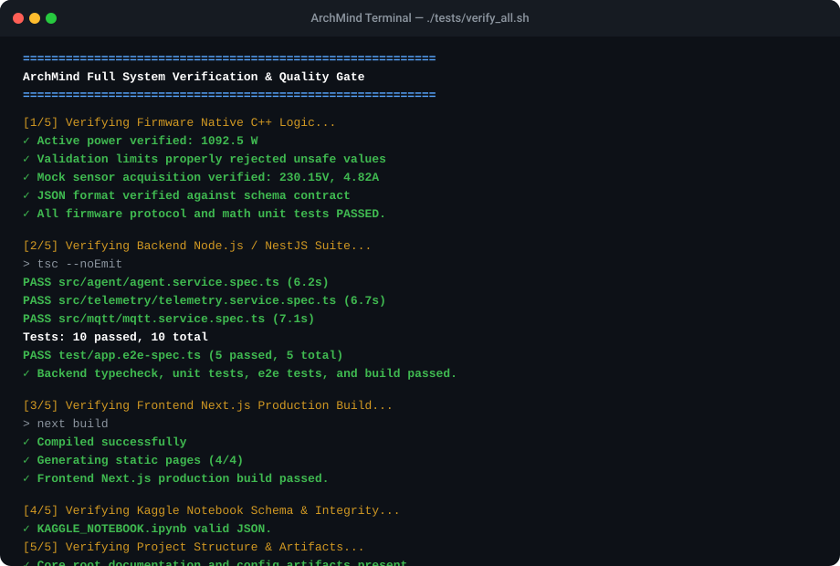
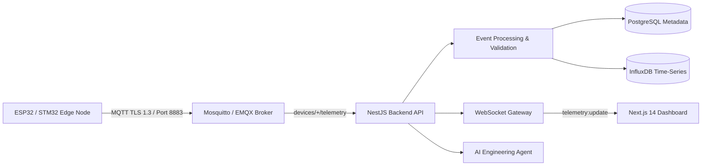

---
language:
- en
- id
license: apache-2.0
tags:
- electrical-engineering
- embedded-systems
- iot
- mqtt
- nodejs
- typescript
- nestjs
- time-series
- agentic-ai
- system-architecture
pretty_name: "ArchMind: Cyber-Physical Electrical & IoT Agent"
---

# ArchMind-Electrical-NodeJS-Agent

<p align="center">
  <strong>Production-Grade Cyber-Physical Architecture: Electrical Hardware, ESP32 Firmware, Resilient MQTT Ingestion, NestJS Microservices, and Real-Time Next.js Dashboards</strong>
</p>

<p align="center">
  <a href="https://github.com"></a>
  <a href="https://nestjs.com"></a>
  <a href="https://nextjs.org"></a>
  <a href="https://espressif.com"></a>
  <a href="https://mqtt.org"></a>
  <a href="LICENSE"></a>
</p>

<p align="center">
  
</p>

---

## 1. System Overview

**ArchMind-Electrical-NodeJS-Agent** is an end-to-end cyber-physical engineering system bridging electrical transducers, microcontroller firmware, secure industrial transport, event-driven Node.js ingestion, dual-tier time-series persistence, and real-time operator dashboards with embedded AI reasoning.



---

## 2. Key Features

- **Electrical Dimensioning & Safety**: Rigorous transducer sizing (SCT-013-000 CT burden resistor calculation, anti-aliasing RC filter design, linear vs. buck thermal dissipation analysis).
- **Hardened ESP32 Firmware**: Dual-core FreeRTOS architecture, hardware Task Watchdog Timer (`esp_task_wdt`), exponential backoff reconnection, and non-blocking sensor acquisition.
- **Secure Transport**: Strict MQTT over TLS 1.3 with certificate validation, broker Access Control Lists (ACLs), and Last Will and Testament (LWT) disconnect detection.
- **High-Throughput Backend**: NestJS microservice architecture featuring typed DTO validation pipes (`class-validator`), Helmet security headers, and rate limiting.
- **Dual Persistence Strategy**: Relational persistence (PostgreSQL) for node metadata and lifecycle state + high-frequency telemetry logging (InfluxDB).
- **Reactive WebSocket Streaming**: Zero-polling live dashboard state updates via Socket.IO.
- **AI Engineering Reasoning**: Dedicated architecture analysis endpoint (`POST /api/agent/analyze`) delivering structured assessments on thermal limits, galvanic isolation, and FMEA countermeasures.

---

## 3. Repository Structure

```text
ArchMind-Electrical-NodeJS-Agent/
│
├── SYSTEM_PROMPT.md            # Agent persona, methodology & electrical safety rules
├── MODEL_CARD.md               # Hugging Face model card & evaluation benchmarks
├── DATA_CARD.md                # Dataset card untuk Hugging Face / Kaggle
├── KAGGLE_NOTEBOOK.ipynb       # Executable electrical calculations & simulation
├── LICENSE                     # Apache 2.0 Open Source License
├── CHANGELOG.md                # Version history adhering to Keep a Changelog
├── CONTRIBUTING.md             # Contribution protocol & engineering rules
├── SECURITY.md                 # Security architecture & vulnerability reporting
├── RELEASE_CHECKLIST.md        # Release verification matrix
├── .gitignore                  # Git exclusion rules
├── .editorconfig               # Consistent code formatting rules
├── .env.example                # Unified environment variable template
│
├── .github/workflows/          # CI/CD Workflows
│   ├── backend.yml             # Backend install, lint, typecheck, test, build
│   ├── frontend.yml            # Frontend build & static verification
│   ├── firmware.yml            # PlatformIO compilation & native test execution
│   └── security.yml            # Automated npm audit vulnerability scanning
│
├── CODE_SCAFFOLDING/
│   ├── firmware/               # ESP32 C++ PlatformIO firmware & MicroPython script
│   ├── backend-nodejs/         # NestJS backend service & e2e test suite
│   └── frontend/               # Next.js 14 App Router real-time dashboard
│
├── docs/                       # Engineering Specifications
│   ├── architecture/           # System design & component interaction
│   ├── api/                    # REST API specifications
│   ├── mqtt/                   # Topic hierarchy, QoS & ACL specifications
│   ├── hardware/               # Electrical schematics, sensor formulas & sizing
│   ├── security/               # STRIDE threat model & OTA security flow
│   ├── deployment/             # Docker Compose & production hardening guides
│   └── VALIDATION_REPORT.md    # Bukti eksekusi riil, benchmark & validasi matematis
│
└── tests/                      # System-wide verification harnesses
```

---

## 4. Quickstart: Local Development

### Prerequisites
- Node.js `v20.x` LTS
- npm `v10.x`
- Python `3.10+`
- (Optional for containers) Docker and Docker Compose

### 1. Environment Configuration
```bash
cp .env.example .env
```

### 2. Backend Setup & Tests
```bash
cd CODE_SCAFFOLDING/backend-nodejs
npm install
npm run typecheck
npm test
npm run test:e2e
npm run build
npm run start:prod
```

### 3. Frontend Dashboard Setup
```bash
cd CODE_SCAFFOLDING/frontend
npm install
npm run build
npm run start
```
Access dashboard at `http://localhost:3000`.

### 4. Firmware Native Logic Verification
```bash
cd CODE_SCAFFOLDING/firmware
g++ -std=c++17 test/test_telemetry.cpp -Iinclude -o test_runner && ./test_runner
```

---

## 5. Docker Orchestration

Launch Mosquitto, PostgreSQL, InfluxDB, backend, and frontend with a single command:

```bash
docker compose -f CODE_SCAFFOLDING/backend-nodejs/docker-compose.yml up -d
```

| Service | Port | Description |
|---|---|---|
| Mosquitto | `8883` / `1883` | Secure MQTT Message Broker |
| PostgreSQL | `5432` | Relational Entity Metadata Database |
| InfluxDB | `8086` | Time-Series Telemetry Store |
| Backend API | `4000` | NestJS REST & WebSocket Gateway |
| Frontend | `3000` | Next.js Operator Dashboard |

---

## 6. Telemetry Contract

All layers adhere strictly to this shared schema:

```typescript
interface TelemetryMessage {
  deviceId: string;       // Unique hardware node identifier
  timestamp: string;      // ISO 8601 UTC timestamp
  voltage?: number;       // Volts RMS (0.0 to 600.0)
  current?: number;       // Amperes RMS (0.0 to 500.0)
  power?: number;         // Watts Active Power
  temperature?: number;   // Celsius (-40.0 to 125.0)
  frequency?: number;     // Hertz (40.0 to 70.0)
  powerFactor?: number;   // Power Factor (0.0 to 1.0)
}
```

---

## 7. REST API Reference

| Method | Endpoint | Auth | Description |
|---|---|---|---|
| `GET` | `/health` | No | System health and service readiness check |
| `GET` | `/api/devices` | API Key | List registered hardware nodes |
| `GET` | `/api/devices/:id` | API Key | Fetch individual node details |
| `POST` | `/api/devices` | API Key | Register a new hardware node |
| `GET` | `/api/telemetry/:deviceId`| API Key | Retrieve recent telemetry records |
| `POST` | `/api/agent/analyze` | API Key | AI Agent engineering architectural assessment |

---

## 8. Electrical Safety Disclaimer

> [!CAUTION]
> **MANDATORY ELECTRICAL SAFETY WARNING**  
> ArchMind is designed to provide engineering architectural analysis and theoretical calculations. It does **NOT** substitute for professional review, certification, or sign-off by a Licensed Professional Electrical Engineer (PE) or accredited testing laboratory (UL, CE, IEC). Never work on mains-voltage circuits without appropriate training, isolation transformers, personal protective equipment (PPE), and adherence to local safety codes.

---

## 9. License

This project is licensed under the [Apache License 2.0](LICENSE).
