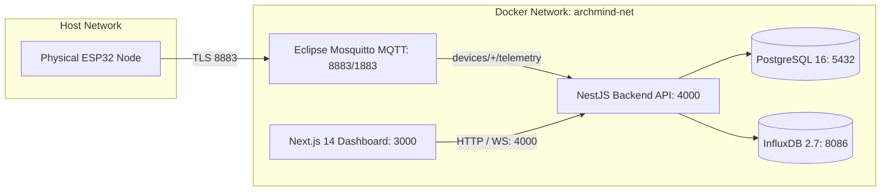

# Deployment Architecture: Docker & Cloud Topology

## 1. Local & Production Docker Compose Topology

ArchMind packages the complete cyber-physical stack into coordinated microservices:



## 2. Running Local Development Stack

```bash
# 1. Copy environment variables
cp .env.example .env

# 2. Build and launch all services in detached mode
docker compose up -d --build

# 3. Check container status
docker compose ps

# 4. Follow backend logs
docker compose logs -f backend
```

## 3. Production Hardening Checklist
- Disable cleartext MQTT port `1883` on the host; expose only `8883` over TLS.
- Mount read-only volume certificates for Mosquitto and NestJS.
- Isolate PostgreSQL and InfluxDB inside the internal Docker network (`archmind-net`), never exposing database ports to the public internet.
- Inject database passwords and API tokens using Docker secrets or Kubernetes HashiCorp Vault sidecars.
